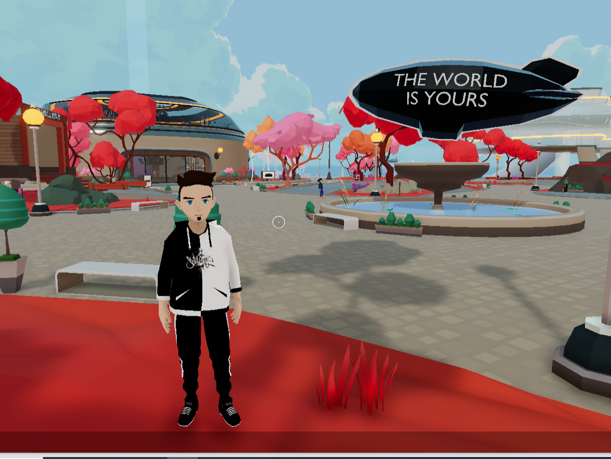
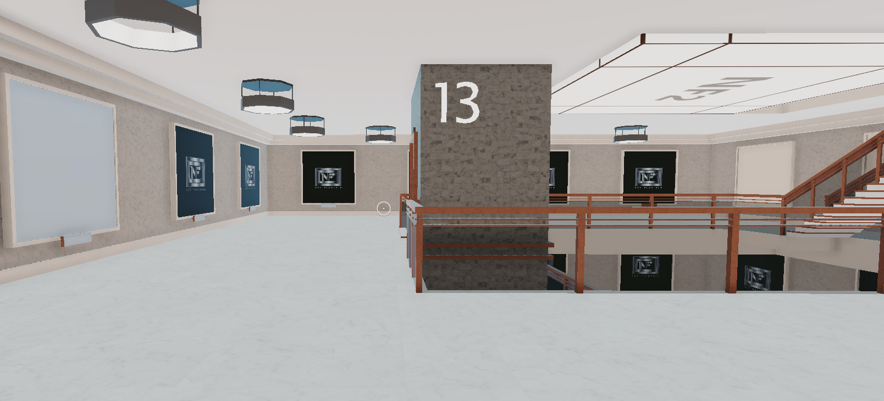
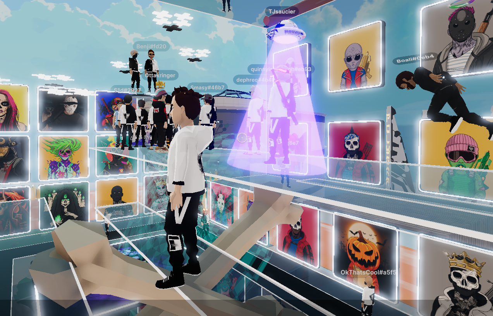
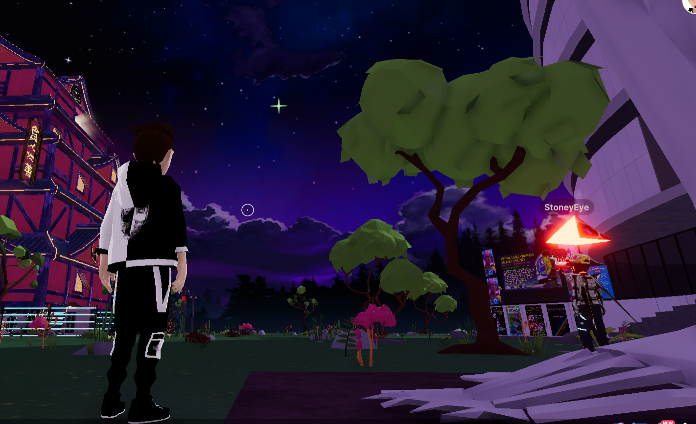

# Primii pasi in Decentraland

## Povestea unui party cu nft-uri in metaversul Decentraland

Înainte de a începe ţin să amintesc că întreaga poveste se găseşte şi pe grupul de discord, iar scopul secţiunii  **5 minutes stories** este de a ţine o evidenţă a poveştilor şi experienţelor împărtăşite de membrii comunităţii  **StakeBorg DAO**.

Povestea primilor mei paşi în Decentraland începe în luna Septembrie, când  am decis să iau câteva colecţii de nft, fără a face un adevarat research, ci pur simplu am luat ce mi-a plăcut, nici măcar dacă era sau nu hype, singurul criteriu a fost să fie sub 0.15 ETH. Am luat câteva proiecte, nimic spectaculos şi demn de menţionat încă.

La aproximativ o lună şi ceva, începutul lui Noiembrie, un proiect din care aveam un nft a făcut un anunţ cu privire la un eveniment din Decentraland. Pe scurt eram invitaţi la un party în care urmau să ne ofere băutură şi aperitive( speram eu), cu dj, paranghelie, tot tacâmul. Aşa că am fost pus în faţa faptului împlinit şi a trebuit să îmi fac cont pe Decentraland şi să imi dau seama cu ce se mănâncă înainte de ora la care avea să se ţină evenimentul. 

Niciodata nu am fost bun la vreun joc pe calculator, pănă acum 1 an şi jumatate nici măcar un windows nu ştiam să instalez, iar în Noiembrie 2021 trebuia să îmi fac cont într-o aplicaţie cu un fel de realitate virtuală, despre care nu ştiam nimic şi pe nimeni.

O dată întrat în aplicaţie, am fost şi pierdut. Serios, oamenii ăia dacă vor adopţie în masă, dacă vor să îl aducă în metavers pe Dorel ca să îi vândă ceva acolo, ar trebui să facă un filmuleţ înainte, să te ia de mânuţă şi să te ghideze pas cu pas, baby steps, altfel va rămâne o altă industrie dedicată celor din gaming.

Mi-a luat 10 min ca să îmi dau seama că pot folosi un chat prin care alţi useri să mă îndrume, dar imediat după, am picat într-un tunel şi am aterizat…la bar. 
Măcar acolo lucrurile păreau simple, dar nici acolo nu am putut să servesc un pahar de vin sau să beau o bere blondă nefiltrată. Şi atunci, nu poţi să nu te întrebi, care este treaba cu metaversul ăsta? În prostia asta cred unii că ne vom petrece zilele în anii următori? Eu prost, dar şi ei… 

În 2h ore, din care 30 min petrecute la bar pentru că nu ştiam să ies de acolo deşi era o usa glisantă care se deschidea când te apropiai( fix ca în realitate), eram în scara unui bloc, la etajul 13, dintr-un ansamblu residenţial (NFT Towers sau ceva de genul acesta). 

Atunci, ca inginer în construcţii, inevitabil îţi vine întrebarea “dar dacă?...dacă poţi să iţi aduci experienţa în realitatea asta virtuală?” şi 3 secunde mai târziu am realizat că nu mai vorbeam de un joc nenorocit, ci foloseam cuvinte precum **realitate virtuală**. Pe măsură ce îţi petreci timp acolo, cu tastatura şi mouse-ul, deci nu cu o pereche de ochelari Oculus Quest 2, iţi dai seama că undeva, ceva, într-un anumit context, poate chiar exista un **al doilea layer al vieţii noastre**.
O a doua realitate în care voi putea să construiesc fără ca Dorel şi cu Vasile să îmi plimbe lopata din stânga în dreapta, fără să vedem 10 oameni adunaţi în jurul unuia care sapă, fără întărzierea furnizorilor de materiale, fără echipe de execuţie care azi au 10 oameni, mâine 3 şi peste alte două zile te trezeşti cu 5.

Sunt sigur, că fiecare în funcţie de backgroundul profesional, ar putea găsi motivaţia şi pasiunea de crea şi a aduce plus valoare unei realităţi care nu doar că le-ar da ocazia să işi continue profesia într-o altă manieră, dar le-ar genera şi venituri. Unele care nu vor fi afectate de dobânda de referinţa a BNR, de cursul de schimb, de inflaţie sau de ce nu, chiar de devalorizarea propriei monede. 

După câteva discuţii pe grupul pe discord cu cei din comunitate, unde aveam nft-ul, am aterziat şi în locul în care urma să se ţină petrecerea. Chiar eram entuziasmat, mai ales că a trecut mult timp de când am fost la un party adevărat, ba mai mult, aici nu aveau cum să mă dea afară.

Nu sunt şi sper nici să nu fie pe viitor gorilele alea care atunci când te văd coborând dintr-o Dacie Logan,  model 2004, iţi spun că şi dacă ai invitaţie, nu ai dress codul potrivit pentru a întra. 

Am fost suprins să constat că aveam muzică, ba mai mult, exact ca în realitate, unii se plângeau ba că este prea tare sunetul, ba că nu le convine genul muzical...

Când s-a anunţat colectarea Poap-ului( motivul principal al evenimentului, un fel de plăsuţă moka cu care pleci acasă), deci a unei insigne şi care trebuia colectată prin apăsarea unui buton dintr-un dispozitiv aflat pe roof top-ul clădirii, laptopul meu de gaming ceda. 

Atenţie, nu eram singurul care semnala acest lucru. Scriau oameni că au băgat şi  5 000$ în unitate şi tot degeaba, iţi făcea freez imaginea, trebuia să întri şi să ieşi de mai multe ori din aplicaţie ca să ajungi la etaj sau chiar în momentul în care apăsai butonul se bloca. 

La un moment dat am lăsat-o baltă şi m-am urcat pe ringul de dans şi am început să dau din coate. Cel mai prost dansator şi cântăreţ din lume sunt eu, dar acolo aveam mişcările mele, mult mai bune decât aş putea vreodata să le afişez în realitate.

Poate nu suntem noi în metaverse, poate **suntem departe**, departe **de momentul în care o platformă va putea suporta 1 000 de oameni în acelaşi spatiu de întâlnire sub forma de avataruri** şi cu o calitate video decentă, nu mai spun incredibilă, dar vreau să vă zic că pentru mine a fost **cea mai mişto petrece din acest an**. 

Comunitatea, discuţiile, plângerile unora legate de genul muzical, mi-au dat senzaţia după aproape 2 ani de pandemie, că se poate şi într-un alt mod. Că putem să avem aceeaşi interacţiuni şi dincolo de a bate la tastatură, dincolo de a te plimba cu mouse-ul pe ecranul monitorului. 

După aproape o ora, la ieşirea din “club” am mai stat vreo 10 min cu muzica în fundal( da, precum în realitate, auzeai muzica pe fundal), am stat să mă minunez de cerul înstelat din Decentraland.

Cred că ceea ce vedem acum este de fapt a 3-a incercare, după aparaţia tehnologiei care ne-a permis să vedem filmele în format 3d/ ultra 4k/ imax, şi după ochelarii VR cu toată industria de gaming pentru VR din 2014/ 2015 şi până acum.

Poate sunt paşi mici la scara istoriei, poate că metaversul va fi construit de un parteneriat între Intel, Nvida, Apple, Google, Opensea, toţi la un loc, unde reţeaua şi partea hardware va fi suficent de avansată încât să permită utilizarea în acelaşi timp a milioane de utilizatori, nu 1 000. 

Pănă atunci, eu voi merge la orice party, concert sau expoziţie ţinută în Decentraland şi mai mult decât atat, voi încerca să învăţ cât mai multe despre tot ce se va întâmpla pe Decentraland, Sand şi în lumea metaversului, poate şi ceva mai multe mişcări de dans.
