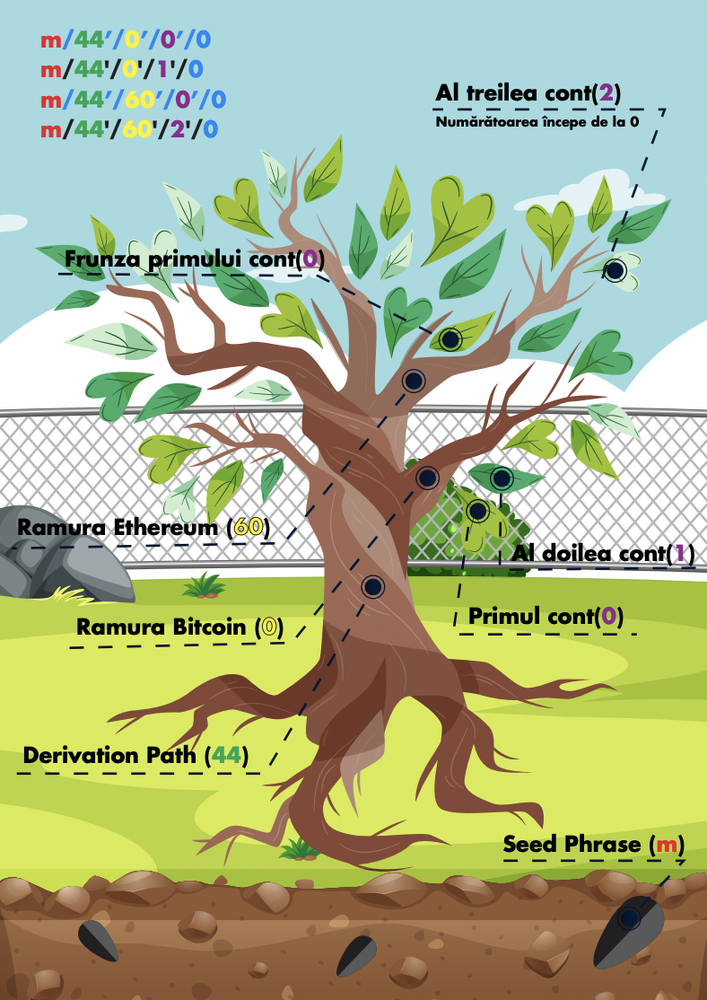

# Cum funcționează Metamask și Ledger

## Cheia Publică și Cheia Privată

Criptografia cu Chei Publice implică două chei: **o cheie privată** (Private Key) care poate fi folosită pentru criptarea, decriptarea și semnarea digitală a fișierelor și o **cheie publică** (Public Key) care poate fi folosită pentru verificarea semnăturilor digitale.

De multe ori este folosită analogia de “Email și Parolă” sau “User și Parolă” când vine vorba de Cheie Privată și Cheie Publică pentru a înțelege mai ușor la ce sunt folosite, însa această analogie nu este întocmai corectă. Cheia Publică este o derivată a Cheii Private în majoritatea protocoalelor.

Cand Blockchain-ul era “fresh out of the oven”, procesul era destul de simplu: Generai o Cheie Privată pe care trebuia, fie să o scrii cu pixul pe hârtie fie să o stochezi într-un loc la care doar tu ai acces.

De exemplu, așa arăta o Cheie Privată pentru **Bitcoin**:

!!!
Kx4FThaEpBuMYaBb2W2P9mfH2TpNVpPaEgjkD3uMPGkct7CQAYVq
!!!

Șansele să scrii ceva greșit erau enorme și probabil astfel s-au pierdut sute de mii de Bitcoin în primii ani…dar a venit rapid o soluție!

## BIP39 / BIP44

**BIP39** este un algoritm capabil să facă corelarea între o **listă de cuvinte** (cunoscută și ca Seed Phrase) și o **Cheie Privată**. Astfel nu mai era nevoie să ții minte/să notezi toate literele și cifrele, ci erau suficiente doar cele 12/24 de cuvinte.

Exemplu lista de cuvinte:

!!!
witch collapse practice feed shame open despair creek road again ice least
!!!

Din păcate, BIP39 nu a rezolvat problema în întregime ci doar a făcut ca acel Seed Phrase să fie human readable. Tot ai fi avut câte un Seed Phrase pentru fiecare cont, pentru fiecare protocol ș.a.m.d. Această problemă a fost rezolvată însă de **BIP44**.

!!!
Listă de cuvinte BIP39 (mnemonic\*) -> Private Key
!!!

BIP44 reprezintă un algoritm care interpretează rezultatul lui BIP39 (acel Seed Phrase) ca un punct de plecare pentru derivarea unui arbore de conturi cu Chei Private specifice conturilor.

Imaginează-ți că ai o listă de cuvinte care va produce mereu semințe identice genetic. Din semințele respective mereu vor crește copaci identici. Ramurile acelor copaci reprezintă protocoale diferite (BTC, ETH, LTC, etc) iar frunzele lor reprezintă cate un cont cu o Cheie Privată specifică respectivului cont.

În loc să generezi o listă de cuvinte (Seed Phrase) care să reprezinte o Cheie Privată folosind BIP39, folosind BIP44 flow-ul arată cam așa:

!!!
Listă de cuvinte BIP39 (mnemonic\*) -> Derivation Path -> Private Key.
!!!

Astfel, folosind BIP39 și BIP44 e suficientă o listă de cuvinte (Seed Phrase) pentru TOATE conturile.

!!!
\*mnemonic = Seed Phrase
!!!

## Cum funcționează Metamask

**Metamask** este folosit pentru transfer de tokeni și apeluri de funcții în contractele inteligente (Smart Contracts). Pe scurt, interacțiunea cu blockchain-ul Ethereum.

În blockchain-ul Ethereum, atât transferurile cât și apelurile de Smart Contracts sunt tranzacții.

O tranzacție trebuie privită ca o scrisoare super securizată, care are un expeditor, un destinatar, un mesaj și o semnătură. “Magia” în securitatea blockchain apare la semnătură.

Acea semnătură trebuie privită ca o formulă _f(x,y)=a,b_ care are două caracteristici:

!!!
Este extrem de greu să afli Cheia Privată fiind date Cheia Publică și Mesajul semnat. Practic, să "spargi" Cheia Privată.
!!!

!!!
Având un a și un b, este extrem de ușor să demonstrezi că a și b sunt o pereche ce este rezultată dintr-o pereche de x și y. Practic, să te uiți la un mesaj semnat, la expeditorul mesajului, și să confirmi că mesajul chiar vine de la el.
!!!

- x este Cheia Privată
- y este Mesajul
- a este Mesajul Semnat
- b este Cheia Publică

Revenind la scrisoare, o tranzacție este o scrisoare în care scrii expeditorul, destinatarul și mesajul, apoi iei o ștampilă specială și pui un sigiliu cu ceară.

Acum destinatarul știe că tu ai scris mesajul, și el nu a fost alterat pe drum, pentru că este sigiliul tău **PESTE** scrisoare...dar cum știe că sigiliul este al tău?

## Cum funcționează Ledger

Până acum știm că:

- Putem genera conturi pe toate Blockchain-urile folosind doar o serie de cuvinte.

- Putem semna tranzacții folosind Cheile Private derivate de către BIP44 din seria respectivă de cuvinte.

**Ledger** le integrează într-un hardware sigur.

Ledger are 2 microcontrollere diferite. Unul pentru majoritatea funcțiilor la care te-ai gândi în mod normal (display, butoane, comunicare prin USB, comunicare prin Bluetooth, memorie ș.a.m.d.) și mai are un **Secure Element**.

Acest Secure Element este un microcontroller construit special pentru a stoca Chei Private și a semna tranzacții. Practic, este ca un sertar cu două ușițe mici în care îți ții ceara și aparatul special pentru semnat. Bagi scrisoarea pe o ușiță, el semnează peste mesaj cu sigiliul tău special și scrisoarea iese pe cealaltă ușiță gata semnată.

"Aparatul" cu care se face semnătură nu părăsește niciodată Ledger-ul. Ba mai mult, nu părăsește niciodată chip-ul Secure Element. Nici măcar celălalt chip nu știe cum s-a calculat semnătura. Despre PC sau Metamask nici vorbă.

Când setezi un Ledger, el îi cere prima dată chip-ului Secure Element să genereze o serie nouă de cuvinte. Tu scrii cuvintele, el ține minte Seed-ul (generat folosind BIP39).

Apoi instalezi o aplicație, să zicem cea de Bitcoin.

Cum se face o tranzacție: Scrii scrisoarea, destinatar, mesaj, ș.a.m.d., și deschizi aplicația pentru Bitcoin pe Ledger.

Ea primește scrisoarea de la tine și știind că vrei
să trimiți Bitcoin, adaugă și Derivation Path-ul
specific Bitcoin. Apoi le trimite pe amândouă la
semnat către Secure Element.

Secure Element are scrisoarea de la tine și Seed-ul. Dar încă nu are Cheia Privată.

Știe că trebuie să deriveze Seed-ul (sămânța) respectiv cu
m/44’/0’/0’/0 (ramura), pentru că așa i-a spus aplicația Bitcoin,
astfel ajungând la Cheia Privată (frunza) pentru Bitcoin. Dacă era aplicația Ethereum, era Derivation Path m/44'/60'/0'/0, fix ca mai sus.

Are mesajul și ceara, semnează și îți dă înapoi scrisoarea gata
semnată pentru a fi trimisă pe blockchain în vederea verificării de către mineri. După verificare, aceasta este trimisă către destinatar.

## Cum se setează Ledger și Metamask

Acum că înțelegem cum funcționează Cheia
Privată, Cheia Publică, Metamask și Ledger, ne
interesează cum ne păstrăm Cheile Private cât
mai sigure.

Cheia Privată, sau orice o poate genera, nu
trebuie să părăsească niciodată Ledger-ul!
Orice are nevoie de semnături, trebuie să treacă prin Ledger. Dacă Seed Phrase-ul nostru a fost generat de Metamask, atunci PC-ul a știut de ele la un moment dat. Dacă băgăm cuvintele în Metamask, atunci
PC-ul o să știe de ele.

!!!danger
Pe scurt, cuvintele nu trebuie să părăsească Ledger-ul!
!!!

Secure Element-ul din Ledger este singurul care are voie să "țină
sămânța"

Cum facem asta cât mai safe?

- Cumpărăm Ledger și Ellipal Metal Wallet.
- Generăm Mnemonic nou din Ledger. Avem sămânța.
- Copiem mnemonic-ul în Ellipal.
- Instalăm o aplicație pe Ledger, de exemplu Bitcoin.
- Verificăm Public Key pentru Bitcoin și o scriem pe hârtie. Public Key
  este la rândul lui derivat din Private Key. Avem o dovadă a frunzei.
- Factory Reset pe Ledger
- Restore Ledger cu Mnemonic-ul scris în Ellipal.
- Instalăm Bitcoin app, verificăm Public Key și că avem aceeași
  dovadă a frunzei. Asta ne confirmă că semințele sunt identice, deci am salvat cuvintele corect.
- Dacă Public Key-ul a rămas la fel, astfel am confirmat (înca o dată, pe lângă ce te pune Ledger să confirmi atunci când generezi un nou Mnemonic) că am scris mnemonic-ul corect în Ellipal.
- Punem Ellipal într-un loc safe. (Se pot folosi două Ellipal-uri, pentru a le pune în două locuri safe).

Beneficii:

- Nu e niciodată nevoie să introduc mnemonic-ul undeva…E nevoie
  doar să instalez aplicația în Ledger pentru fiecare coin. Să spunem că instalez Ethereum și conectez Metamask la hardware wallet.
- În tot acest proces, Seed-ul nu a ajuns pe niciun device electronic în afară de Ledger (și nici nu o să ajungă vreodată).
- Mi-am transferat toate fondurile din toate coinurile către noile conturi generate de Ledger.
