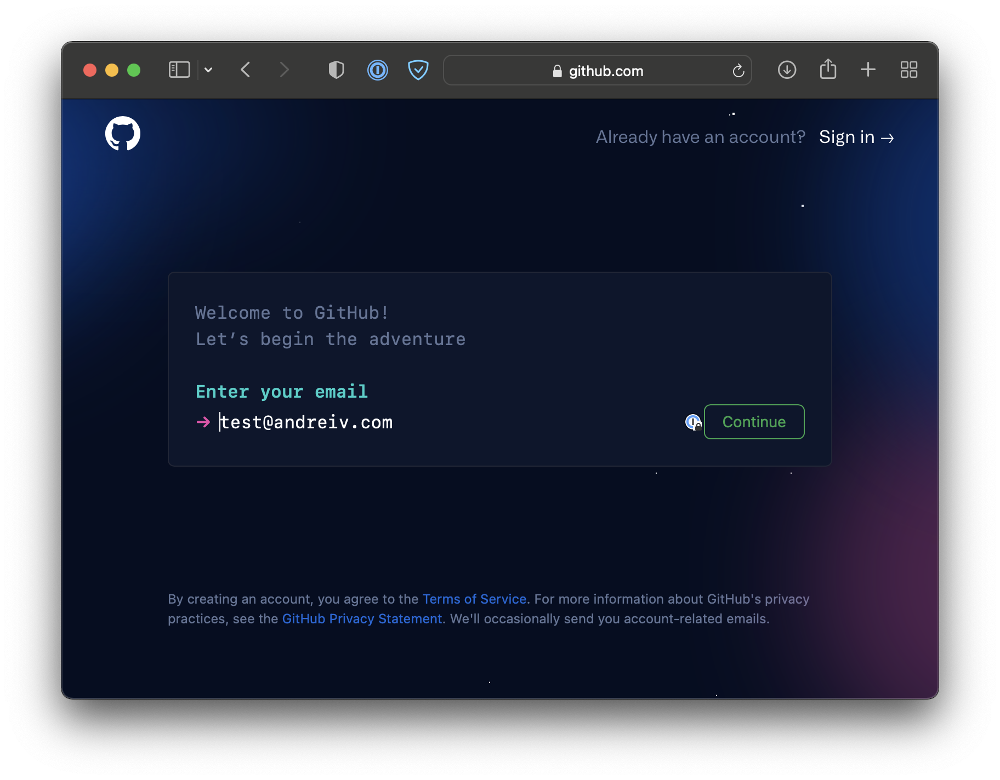
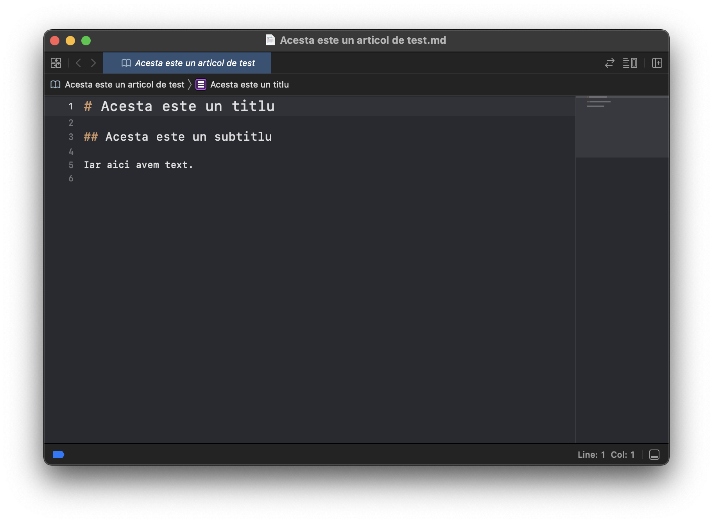

# Articolul despre cum se scriu articole pe platforma cu articole

Atunci cand ne-am decis sa cream aceasta platforma, m-am tot gandit care era cea mai buna varianta tehnica.

Am decis sa folosim [Retype](retype.com) din doua considerente:

- articolele sunt scrise in format markdown, lucru care face migrarea catre orice alta platforma relativ usoara
- Github Pages poate fi folosit pentru hosting gratuit

Stiu, sunt multi printre voi care si-ar dori sa contribuie cu materiale aici dar nu sunt familiari nici cu Github, nici cu markdown, insa ambele sunt standarde in industrie si cred ca putem folosi aceasta ocazie intr-un mod constructiv.

Sa vedem cum putem contribui cu un articol aici:

Sursa articolelor este Github, mai precis [aici](https://github.com/andreivdev/stakeborgdaocommunity).

Pentru a adauga un articol nou, avand in vedere modul in care functioneaza Github, este nevoie de un **pull request**. Un pull request reprezinta o propunere de modificare a unui repository Github.

Pentru a putea face un pull request, este mai intai nevoie ca modificarea propusa sa existe undeva pe Github. Propunerea nu poate sa existe direct pe respository-ul unde vrem sa aducem modificarea, pentru ca (cel mai probabil) nu suntem owneri ai acelui repository. De-aia trebuie mai intai sa facem un **fork**.

Un fork reprezinta o copie a unui repository, copie care nu mai apartine autorului original, ci ne apartine noua.

Acum ca avem propria varianta a repository-ului, putem face modificarile pe **fork-ul nostru**.

In momentul in care exista diferente intre fork-ul nostru si repository-ul original, Github ne permite sa facem un **pull request** catre repository-ul original care apoi poate fi acceptat de catre autorul original.

Sa trecem la practica:

In primul rand, avem nevoie de un cont Github

Acum ca avem contul, trebuie sa facem fork-ul.

Pe pagina https://github.com/andreivdev/stakeborgdaocommunity, folosim butonul "Fork" din dreapta, sus.

Puteti observa ca autorul nu mai este _andreiv_, ci _testaccount1002_.

Mai puteti observa mentiunea

!!!
This branch is up to date with andreivdev:main.
!!!

Asta inseamna ca momentan nu exista diferente intre fork-ul nostru si repository-ul original.

Avem cont, avem propriul fork pentru repository, cum scriem articole? Pana acum totul s-a intamplat pe serverele Github, trebuie sa aducem cumva acele fisiere pe PC-ul nostru.

Pentru asta urmeaza sa folosim [Github Desktop](https://desktop.github.com/).

Dupa ce descarcam, instalam si ne logam in Github Desktop folosind contul Github, ar trebui sa vedem un ecran similar

In partea dreapta vedem ca Github Desktop stie ca avem deja un repository in contul nostru, mai precis fork-ul facut anterior. Il selectam si il clonam intr-un folder local.

Acum avem local toate fisierele din repository in destinatia aleasa anterior

Sa presupunem ca vrem sa scriem un nou articol in **5 minute stories**.

Articolul trebuie sa fie un fisier **.md** in [formatul markdown](https://www.markdownguide.org/basic-syntax/).

Momentan articolul este prezent doar local, pe PC-ul nostru. Inainte sa facem pull request, trebuie mai intai sa il uploadam pe fork-ul nostru.

Pentru asta ne intoarcem in Github Desktop, facem mai intai **commit to main**, apoi **push origin (1)**

Acum modificarile sunt pe serverele Github, pe fork-ul nostru

Textul _This branch is up to date with andreivdev:main._ care anterior ne spunea ca nu exista diferente intre fork si original acum s-a schimbat in

!!!
This branch is 1 commit ahead
!!!

Indicand astfel ca exista o modificare intre fork-ul nostru si repository-ul original. Deci putem face un pull request

Pull request-ul urmeaza sa fie aprobat iar pagina https://stakeborgcommunity.ddns.net/ va fi generata automat.

Puteti oricand sa va inspirati din formatul celorlalte articole iar pentru
verificarea formatului Markdown, recomand https://stackedit.io/app#.
