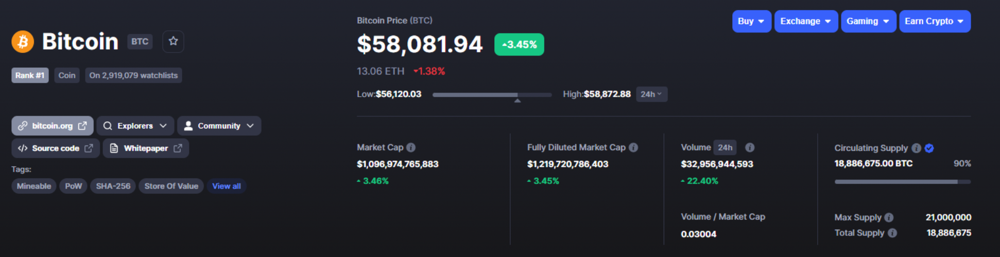
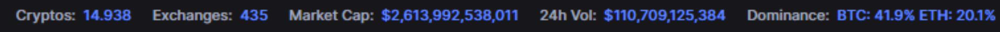
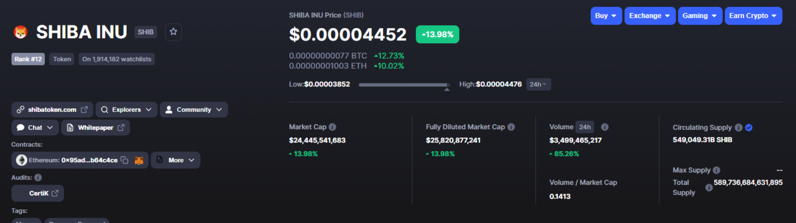

# Ce este capitalizarea de piață?

Te-ai întrebat vreodată de ce o criptomonedă care costă 1$/buc este clasată în top pe Coinmarketcap mai sus ca o criptomonedă care costă 100$/buc?

În cadrul acestui articol din StakeborgDAO- Learning bites voi explica ce este capitalizarea de piață, cum se calculează, de ce contează mai mult dacă ai 0.1 Bitcoin decat 10.000.000 SHIB și de ce tokenomicsul unui proiect te poate predispune la eșec sau succes.

## Ce este capitalizarea de piață?

Capitalizarea de piață reprezintă valoarea aboslută a unui asset(activ, bun, etc). In crypto, capitalizarea de piață a
unui proiect se calculează înmulțind volumul total al tokenilor aflați in circulație cu prețul unui token.

Atunci cand intrăm într-un proiect este foarte important să analizăm economia monedei native blockchainului. Astfel, putem vedea cat din volumul total se află deja în circulație și implicit cat poate să se mai aprecieze în diferite scenarii.

În cazul Bitcoin, capitalizarea de piață se calculează înmulțind cei 18,886,675 BTC aflați în circulație cu prețul unui Bitcoin, adică $58,081.94. De aici, rezultă acel $1,096,974,765,883, care reprezintă aproximativ 41.9% din capitalizarea totală a pieței crypto și care este folosit și în determinarea dominanței Bitcoinului față de alte cryptomonede.

Din cifrele pe care le-am pomenit, putem deduce faptul că Bitcoin este regele, iar dacă Bitcoin se duce în sus sau în jos va trage și piața după el pentru că ocupă un procent atat de mare din capitalizarea de piață totală din crypto. Desigur, există și excepții de la regulă, dar aici intrăm deja în zona de analiză tehnică și speculație, subiect care va fi abordat în articolele viitoare.

Pentru aprofundarea subiectului, vom lua ca exemplu alt proiect popular și îl vom compara cu Bitcoin, pentru a înțelge mai bine de ce nu contează cate bucați ai în portofel și la ce riscuri ne expunem cand tokenomicsul este făcut să ne fure ochii.

Shiba Inu este unul dintre cele mai căutate trenduri pe google atunci cand ne raportăm la crypto. Este fără îndoială unul dintre proiectele cele mai cunoscute, avand în spate și o comunitate puternică.

Putem spune că Dogecoin a pornit trendul, iar copiile ca Shiba sau Safemoon au copiat ”formula succesului” și anume bad tokenomics.

Formula de calcul a capitalizării de piață este identică, însă putem observa că numerele diferă dramatic, mai precis volumul maxim total care din cate știm ar putea merge la infinit și ar crește inevitabil inflația tokenului într-un mod nesustenabil.

Se vede din start că numărul de tokeni aflați în circulație este atat de greu de citit, încat cei de la Coinmarketcap au adăugat un ”B”(billions/miliarde) în spatele ultimei cifre. Din acest motiv și prețul/token este atat de mic comparativ cu Bitcoin. Pentru multă lume nouă în spațiu sau care investește/speculează pentru prima oară, acesta este semnalul de buy pentru că, mai pe romanește cu cat este traista mai plină, cu atat mai bine.

Însă, de cele mai multe ori prețul pe care îl plătim pentru educație sunt propriile economii, iar o astfel de abordare te poate lăsa frustrat și cu opinii greșite despre crypto. Acesta este și motivul pentru care, oameni precum Charles Hoskinson, fondatorul Cardano și co-fondatorul Ethereum critică astfel de proiecte și oamenii care le promovează. Deși atrag foarte multi oameni dornici să se îmbogățească rapid(motive fundamental greșite), la fel de repede vor părăsi și spațiul după ce un portofel ”balenă” vinde un procent semnificativ de tokeni, lăsandu-i pe restul cu ochii în soare.

Din acest motiv subiectul capitalizării de piață este atat de important. Odată ce îl înțelegi, nu mai ești în tabară cu moonboys și prețurile țintă promovate de influenceri devin subiect de amuzament, pentru că înțelegi de ce un SHIB la 10 cenți ar înseamna o capitalizare de piață de zeci de trilioane de dolari, cu mult peste valoarea actuală a BTC și a pieței per total.

În final, aș vrea să adaug că la sfarșit de zi fiecare dintre noi are obiective diferite pe care își dorește să le atingă, iar felul în care ne construim portofoliul digital se rezumă la responsabilitatea individuală și felul în care îți faci temele, acestea fiind doar o parte din valorile libertariene pe care a fost construită industria. Fiecare individ are o toleranță la risc diferită în funcție de mulți factori(varsta, venituri, orizont de timp, etc) iar ce merge pentru X, de multe ori nu merge și pentu Y.

Înainte de orice alegere care știi că te-ar putea costa e bine să iei o pauză în care să reflecți obiectiv asupra deciziei tale. Iar, alegerile mai bune le facem cu o educație corespunzătoare.

Shinmen Takezo ETH:0x09b529B17A8103528A0adc9D7FD796574E7290CA
